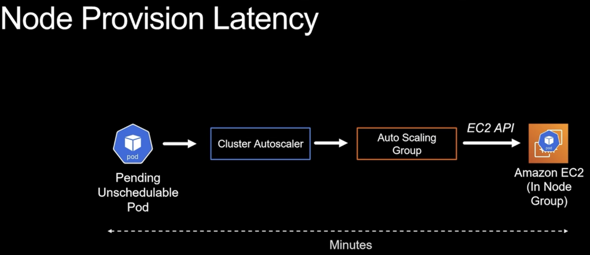
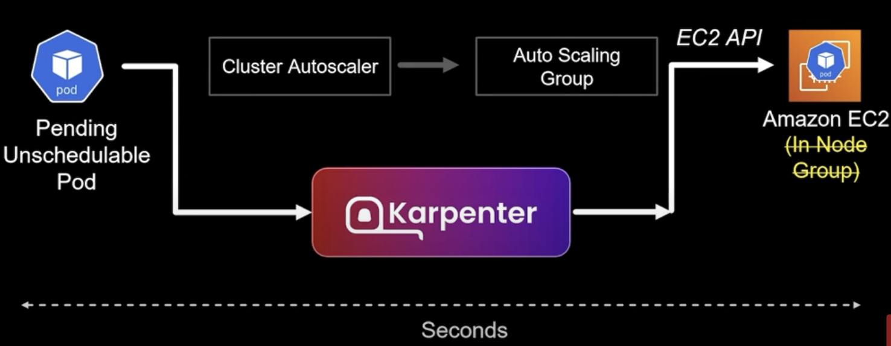

## 1. Installation

### 1.1. Precondition

- kubectl
- eksctl
- aws cli

### 1.2. Create a cluster

```
eksctl create cluster \
  --name eks-cluster \
  --region eu-north-1 \
  --version 1.31 \
  --nodegroup-name standard-workers \
  --node-type t3.medium \
  --nodes 1 \
  --nodes-min 1 \
  --nodes-max 2 \
  --managed
```

### 1.3. Associate IAM OIDC Provider

```
eksctl utils associate-iam-oidc-provider \
  --region eu-north-1 \
  --cluster eks-cluster \
  --approve
```

### 1.4. Create an IAM Policy for Cluster Autoscaler
```
aws iam create-policy \
  --policy-name AmazonEKSClusterAutoscalerPolicy \
  --policy-document '{
      "Version": "2012-10-17",
      "Statement": [
          {
              "Effect": "Allow",
              "Action": [
                  "autoscaling:DescribeAutoScalingGroups",
                  "autoscaling:DescribeAutoScalingInstances",
                  "autoscaling:DescribeLaunchConfigurations",
                  "autoscaling:DescribeTags",
                  "autoscaling:SetDesiredCapacity",
                  "autoscaling:TerminateInstanceInAutoScalingGroup",
                  "ec2:DescribeLaunchTemplateVersions"
              ],
              "Resource": "*"
          }
      ]
  }'
  ```

### 1.5.  Create a Service Account for Cluster Autoscaler
```
eksctl create iamserviceaccount \
  --name cluster-autoscaler \
  --region eu-north-1 \
  --namespace kube-system \
  --cluster eks-cluster \
  --attach-policy-arn arn:aws:iam::<AWS_ACCOUNT_ID>:policy/AmazonEKSClusterAutoscalerPolicy \
  --approve \
  --override-existing-serviceaccounts
```  

### 1.6. Deploy Cluster Autoscaler

```
curl -O https://raw.githubusercontent.com/kubernetes/autoscaler/cluster-autoscaler-release-1.31/cluster-autoscaler/cloudprovider/aws/examples/cluster-autoscaler-autodiscover.yaml
```

- Update the Cluster Autoscaler arguments:

  - Replace <YOUR_CLUSTER_NAME> with eks-cluster
  - Add the following flags to the container command section
    ```
      - --balance-similar-node-groups
      - --skip-nodes-with-system-pods=false
    ```
- Ensure the image matches the Kubernetes version of your cluster.For example:
  - ```image: k8s.gcr.io/autoscaling/cluster-autoscaler:v1.31.1```

### 1.7. Apply the Manifest

```kubectl apply -f cluster-autoscaler-autodiscover```

### 1.8.  Annotate Cluster Autoscaler

```
kubectl annotate deployment cluster-autoscaler \
  -n kube-system \
  cluster-autoscaler.kubernetes.io/safe-to-evict=true
```  

### 1.9. Verify the Setup

```kubectl get pods -n kube-system | grep cluster-autoscaler```  


### 1.10. Deleting the K8S Cluster and created other resources

- ```eksctl delete cluster --region=eu-north-1 --name=eks-cluster```

- ```aws iam list-policies --query 'Policies[?PolicyName==`AmazonEKSClusterAutoscalerPolicy`].Arn' --output text```

  - ```aws iam delete-policy --policy-arn arn:aws:iam::<AWS_ACCOUNT_ID>:policy/AmazonEKSClusterAutoscalerPolicy```


## Note
- Cluster Autoscaler Challenges
  - When a pod is unschedulable due to insufficient resources, Cluster Autoscaler requests additional capacity by scaling the Auto Scaling Group via the EC2 API, provisioning new nodes in minutes to satisfy the workload's requirement.

  -  (1*)
- Better solution is using the Karpenter:
 -  (1*)

## References 

(1*) [Karpenter for Kubernetes Tutorial with Demo - Cloud with Raj](https://www.youtube.com/watch?v=cc2leue9P3s)


