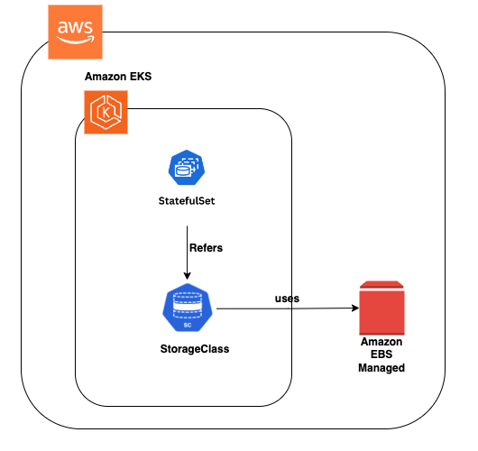

## Goal
-  Deploy a MongoDB replica set inside an Amazon EKS Kubernetes cluster using:
   - StatefulSets (for stable pod identity and persistent volumes)
   - Amazon EBS CSI driver (for dynamic volume provisioning)
   - Terraform (for infrastructure as code)
   - Secrets: to securely share authentication between MongoDB pods

## Simple Explanation

- MongoDB runs inside Kubernetes pods as a containerized application.

- Each pod uses a dedicated Amazon EBS volume for persistent storage, ensuring data remains intact across pod restarts or rescheduling.


## Architecture

 - 
   - This diagram shows a MongoDB replica set deployed on Amazon EKS using a StatefulSet. - Each pod (mongodb-0 as PRIMARY, mongodb-1 and mongodb-2 as SECONDARY) gets its own dynamically provisioned EBS volume via the EBS CSI driver, and all are discoverable via a headless service for stable DNS.
 - 
   - This diagram shows that the StatefulSet provisions Amazon EBS volumes via the specified StorageClass in an EKS cluster.


### 1. Create a K8S cluster

- terraform init

- terraform plan -out plan.out | tee out.txt

- terraform apply plan.out 

- aws eks --region eu-north-1 update-kubeconfig --name example-eks-cluster


### 2. Create StorageClass

- Defines ebs-csi StorageClass using AWS EBS

- Apply: 
 - ```kubectl apply -f 01-storageclass.yaml```

- Verify: 
 - ```kubectl get storageclass```

### 3. Create Headless Service
- Creates headless service mongodb-service for pods

- Apply: 
 - ```kubectl apply -f 02-headless-svc.yaml```

- Verify: 
 - ```kubectl get svc```

### 3. Set up Authentication

- Generate keyfile:

```
sudo bash -c "openssl rand -base64 756 > mongodb-keyfile"
sudo chmod 400 mongodb-keyfile

```

- Create secret: 
  - ```kubectl create secret generic mongodb-keyfile --from-file=mongodb-keyfile```

### 4. Create StatefulSet for MongoDB
- Deploys 3-member MongoDB ReplicaSet with volumes

- Apply: 
  - ```kubectl apply -f 03-statefulset.yaml```

- Verify: 
  - ```kubectl get statefulsets```
  - ```kubectl get pods```

### 5. Configure MongoDB Replica Set

- Run this only once after pods are running.

```
kubectl exec -it mongodb-0 -- mongosh
```

- Then run:

```
rs.initiate({
  _id: "rs0",
  members: [
    { _id: 0, host: "mongodb-0.mongodb-service:27017", priority: 2 },
    { _id: 1, host: "mongodb-1.mongodb-service:27017", priority: 1 },
    { _id: 2, host: "mongodb-2.mongodb-service:27017", priority: 1 }
  ]
})

- The command above initializes a MongoDB replica set named rs0 with three members 
  - (mongodb-0, mongodb-1, mongodb-2). 
  - it defines each pod as a member of the set and sets the priority for election, making mongodb-0 the preferred primary. 
```

-  After that insert some data
```
db.femaleusers.insertMany([
  { name: "Jane Doe", age: 30, email: "jane.doe@example.com" },
  { name: "Mary Smith", age: 25, email: "mary.smith@example.com" },
  { name: "Alice Johnson", age: 28, email: "alice.johnson@example.com" },
  { name: "Emily Davis", age: 32, email: "emily.davis@example.com" },
  { name: "Sarah Brown", age: 27, email: "sarah.brown@example.com" }
])
```
- Then check the insterted data:
  - db.femaleusers.find().pretty()


### 6. Delete the cluster

``eksctl delete cluster --name example-eks-cluster --region eu-north-1``

### References:

(1*) [Deploying MongoDB cluster to Kubernetes](https://www.youtube.com/watch?v=eUa-IDPGL-Q)

(2*) https://devops.supportsages.com/setting-up-mongodb-as-a-statefulset-in-kubernetes-a-step-by-step-guide-6e9144b2d679

(3*) https://www.mongodb.com/developer/products/mongodb/mongodb-with-kubernetes/

(4*) https://www.bionconsulting.com/blog/running-production-ready-databases-on-eks-part-1