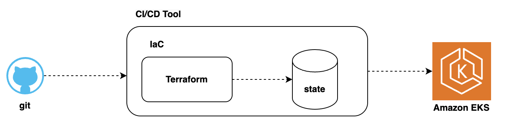
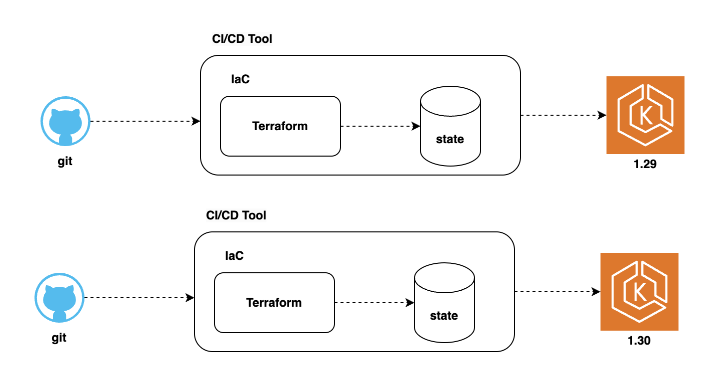
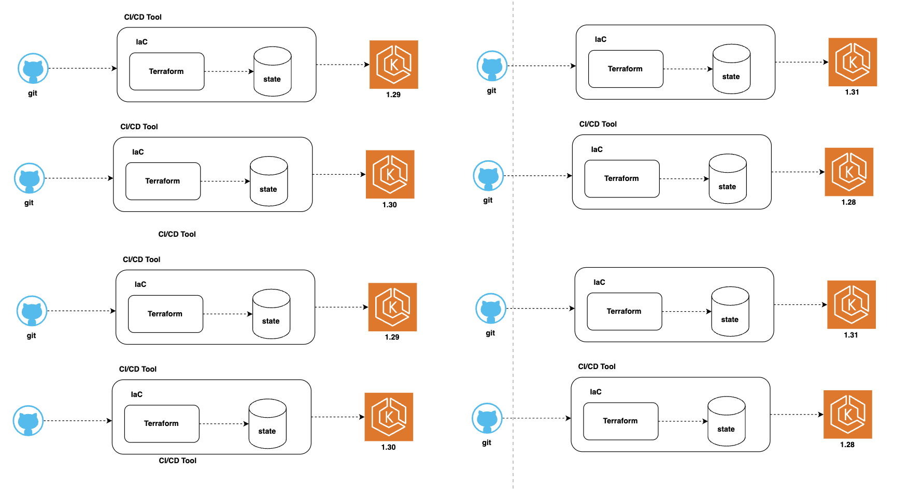

### Platform

- Platform is a shared, automated system built by Platform Engineers to help developers deploy and run applications easily and securely.

### Challenges for the platform team

- Consistent cluster lifecycle management
  - Creating, upgrading, and deleting EKS clusters must follow the same standards across environments (dev/stage/prod).
- Monitoring and alerts across clusters
  -  It's hard to get a single view of logs, metrics, and alerts when many clusters are used especially in different regions/accounts.
- Supporting multiple teams with guardrails
  - Dev teams need freedom, but also rules and limits (guardrails) to ensure security, cost control, and reliability.

#### Simple Management

#### Manageable growth

#### Unmanageable growth

#### Key Challenges

- Cluster management
  - Enforce security rules and best practices automatically across all clusters.
  - (Example: All clusters must have logging and network policies.)

- Configuration management
  - Use a central source (like Git) to automate settings and version upgrades
  - (Example: Change Kubernetes version or node group settings from one place.)

- Add-on management
  - Easily install tools like CoreDNS, VPC CNI, etc., with dependencies managed.
  - (Example: Automatically add monitoring or networking plugins to EKS.)

- Workload management
  - Deploy and scale many apps efficiently across multiple clusters.
  - (Example: Run 50 apps across 5 clusters without repeating manual steps.)

### References:

(1*) [AWS re:Invent 2024 - Building production-grade resilient architectures with Amazon EKS (KUB404)](https://www.youtube.com/watch?v=g9USwIPr7Xs)