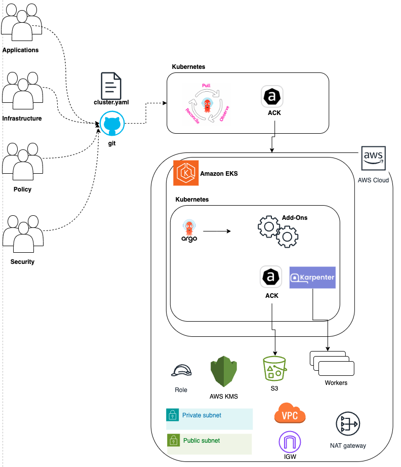
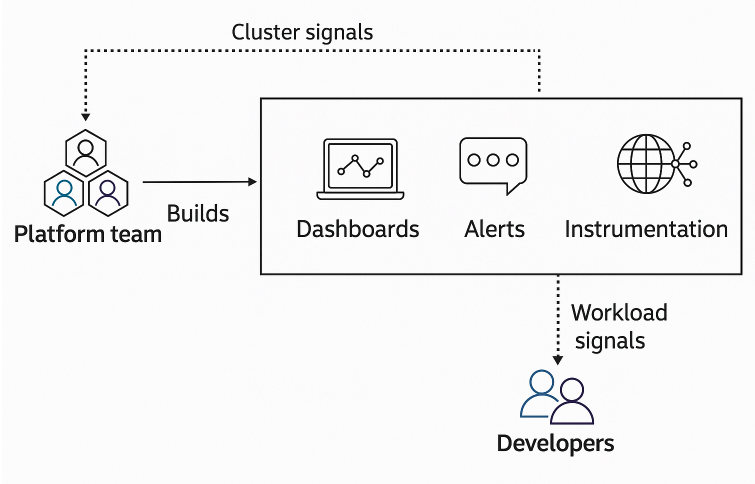
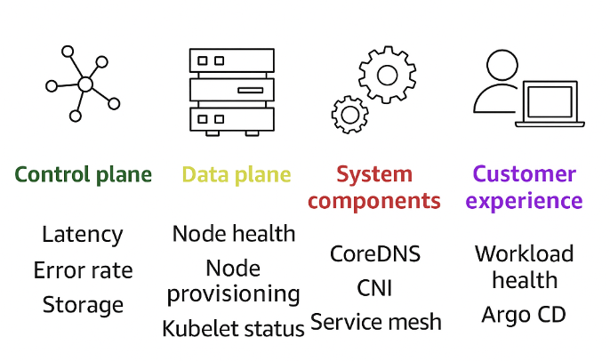
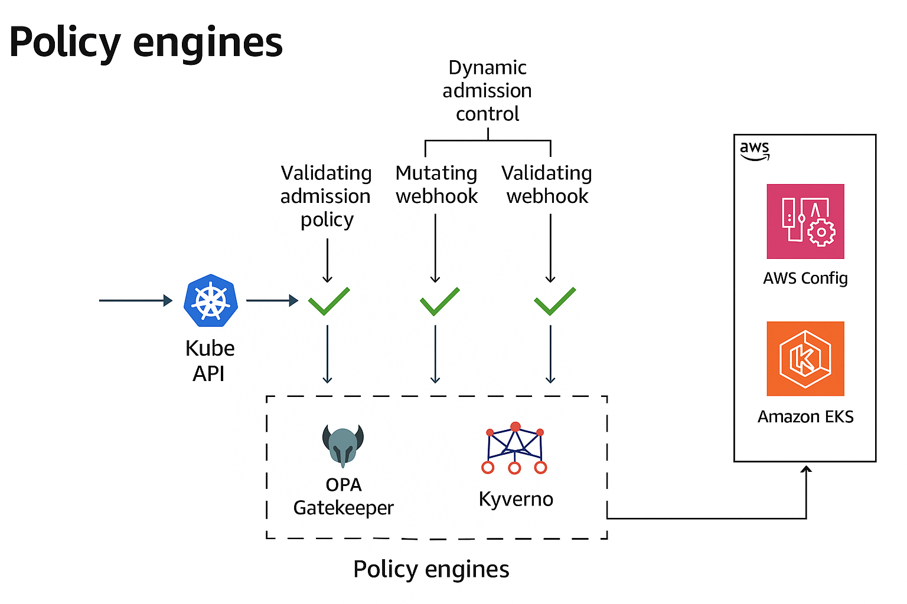
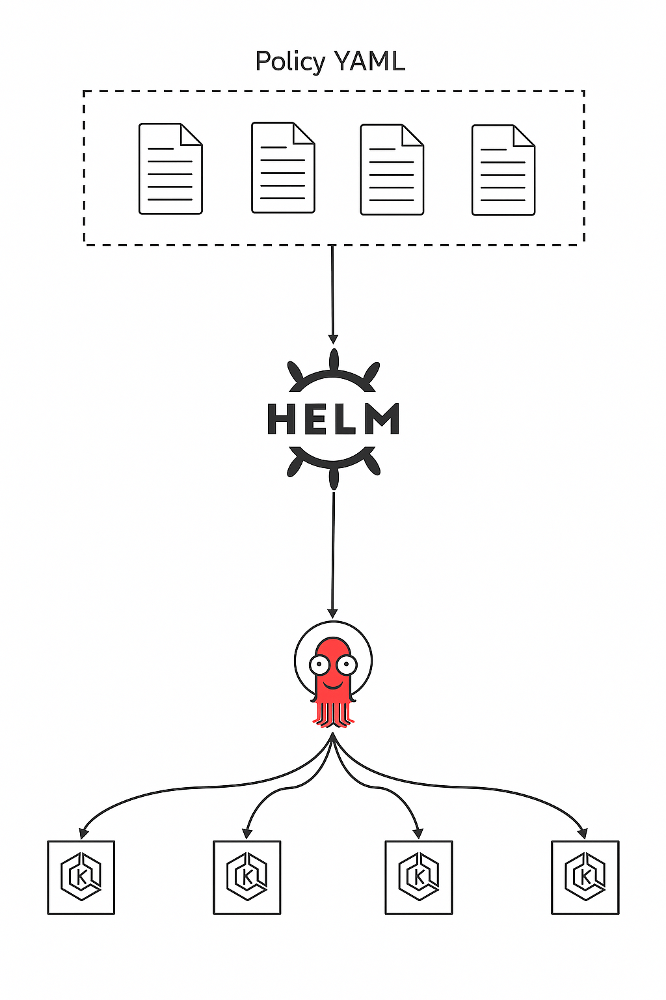
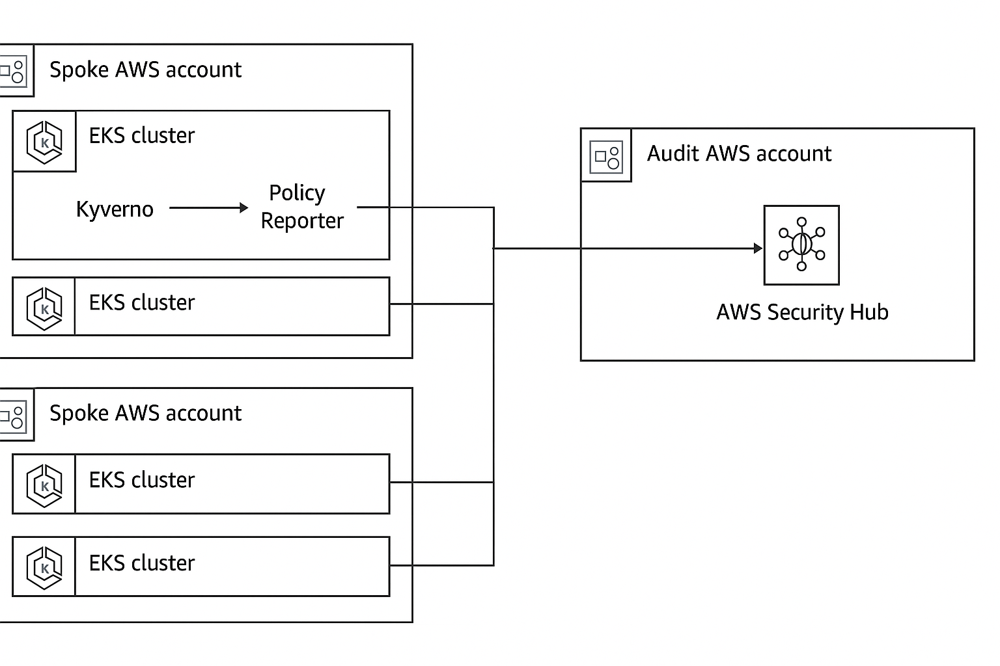

### Platform

- Platform is a shared, automated system built by Platform Engineers to help developers deploy and run applications easily and securely.

### Challenges for the platform team

- Consistent cluster lifecycle management
  - Creating, upgrading, and deleting EKS clusters must follow the same standards across environments (dev/stage/prod).
- Monitoring and alerts across clusters
  -  It's hard to get a single view of logs, metrics, and alerts when many clusters are used especially in different regions/accounts.
- Supporting multiple teams with guardrails
  - Dev teams need freedom, but also rules and limits (guardrails) to ensure security, cost control, and reliability.

#### Simple Management


#### Manageable growth


#### Unmanageable growth


#### Key Challenges

- Cluster management
  - Enforce security rules and best practices automatically across all clusters.
  - (Example: All clusters must have logging and network policies.)

- Configuration management
  - Use a central source (like Git) to automate settings and version upgrades
  - (Example: Change Kubernetes version or node group settings from one place.)

- Add-on management
  - Easily install tools like CoreDNS, VPC CNI, etc., with dependencies managed.
  - (Example: Automatically add monitoring or networking plugins to EKS.)

- Workload management
  - Deploy and scale many apps efficiently across multiple clusters.
  - (Example: Run 50 apps across 5 clusters without repeating manual steps.)


### Amazon EKS with GitOps


  - This diagram shows a GitOps-based EKS platform using ArgoCD and AWS ACK to manage both applications and AWS infrastructure.
  - Teams manage everything via: 
    - Git → ArgoCD applies it → ACK provisions AWS infra → All runs in secure EKS setup.

- **AWS ACK (AWS Controllers for Kubernetes)** is a set of Kubernetes controllers that let you manage AWS services directly from Kubernetes using Kubernetes-native APIs.

   - With ACK, you can define AWS resources (like S3 buckets, DynamoDB tables, SNS topics, etc.) using Kubernetes YAML manifests — no need to switch to Terraform or the AWS Console.

```
apiVersion: s3.services.k8s.aws/v1alpha1
kind: Bucket
metadata:
  name: my-bucket
spec:
  name: my-bucket-name
```

   - The ACK controller sees this and creates the bucket in AWS automatically.


### Observability at scale

#### 1. Roles and Responsibilities



   - The platform team builds dashboards, alerts, and instrumentation tools to monitor the system. 
   - These tools send signals to both the platform team (cluster signals) and developers (workload signals) to help them detect and fix issues.

#### 2. What to alert on?




1. Control plane:
- Alert on issues like latency, error rate, and storage problems.

2. Data plane:
- Watch for node health, provisioning issues, and kubelet status.

3. System components:
- Monitor CoreDNS, CNI plugins, and service mesh behavior.

4. Customer experience:
- Track workload health and tools like Argo CD to ensure app delivery and performance.


#### 3. Cluster Inventory

- Using **Backstage**: It gives DevOps and platform teams a single pane of glass to view and manage all clusters and workloads easily

- Using **Amazon EKS Dashboard**:  It is a lightweight, centralized view of all EKS clusters inside AWS without external tools.

### Govern

#### What does governance enable?

- Security & compliance – Meet security and audit requirements.

- Adaptability & flexibility – Adjust to changing business needs.

- Cost-effectiveness – Stay within financial limits.

- Scalability & resilience – Support business growth and stability.

#### Policy Engines



- Kube API receives a request (e.g., create pod).

- The request passes through:

  - ✅ Validating admission policies (built-in)

    - These are native Kubernetes features (since v1.26+) that let you define rules directly in the cluster to accept or reject requests before they’re applied.
    - A built-in way to enforce rules without extra tools like Kyverno or Gatekeeper.
  - ✅ Mutating webhooks (modify request if needed)

  - ✅ Validating webhooks (approve/reject request)

- Tools like OPA Gatekeeper or Kyverno implement these webhooks to enforce policies.

- Results are integrated into AWS Config and Amazon EKS for compliance and visibility.

- In Short -> Kyverno or Gatekeeper validate or modify Kubernetes requests to enforce security, compliance, or operational rules before deployment.

##### Managing Policies




##### Policy Findings for fleets



- Kyverno runs in EKS clusters to enforce policies.

- Policy Reporter collects violations.

- Violations are sent from spoke accounts to the audit account.

- AWS Security Hub aggregates and displays the results centrally.

### References:

(1*) [AWS re:Invent 2024 - Building production-grade resilient architectures with Amazon EKS (KUB404)](https://www.youtube.com/watch?v=g9USwIPr7Xs)

(2*)[Centralize visibility of Kubernetes clusters across AWS Regions and accounts with EKS Dashboard](https://aws.amazon.com/blogs/aws/centralize-visibility-of-kubernetes-clusters-across-aws-regions-and-accounts-with-eks-dashboard/)